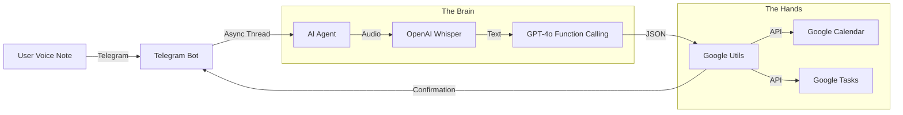

# 🧠 Second Brain Bot (Voice-to-Calendar Agent)

**Second Brain** is a multimodal AI agent that lives in Telegram. It listens to your voice notes, intelligently extracts tasks and events, and automatically syncs them to your **Google Calendar** and **Google Tasks**.


---

## ✨ Features

- **🗣️ Voice-First Interface:** Send raw voice notes—the bot handles transcription using Whisper
- **🧠 Intelligent Extraction:** Distinguishes between "Events" (scheduled times) and "Tasks" (to-dos)
- **📅 Real-Time Sync:** Instantly creates Google Calendar events and Google Tasks
- **⚡ Non-Blocking Core:** Uses asynchronous processing to handle requests without freezing the chat interface

---

## 🏗️ Architecture


---

## 🚀 Installation

### 1. Clone the Repository
```bash
git clone https://github.com/YOUR_USERNAME/second-brain-bot.git
cd second-brain-bot
```

### 2. Install Dependencies
```bash
pip install -r requirements.txt
```

### 3. Setup Credentials

#### Environment Variables
Create a `.env` file in the root directory:
```env
OPENAI_API_KEY=your_openai_api_key_here
TELEGRAM_BOT_TOKEN=your_telegram_bot_token_here
```

#### Google Cloud Credentials
1. Go to [Google Cloud Console](https://console.cloud.google.com/)
2. Create a new project (or select existing)
3. Enable **Google Calendar API** and **Google Tasks API**
4. Create OAuth 2.0 credentials (Desktop App)
5. Download `credentials.json` and place it in the root folder

### 4. Run the Bot
```bash
python src/main.py
```

On first run, you'll be prompted to authenticate with Google in your browser.

---

## 📦 Project Structure
```
second-brain-bot/
├── src/
│   ├── main.py              # Entry point
│   ├── agent.py             # AI agent logic
│   ├── google_utils.py      # Google API integration
│   └── telegram_bot.py      # Telegram bot handlers
├── credentials.json         # Google OAuth credentials
├── token.json               # Auto-generated after first auth
├── .env                     # Environment variables
├── requirements.txt         # Python dependencies
└── README.md
```

---

## 🛠️ Tech Stack

| Component | Technology |
|-----------|-----------|
| **Speech-to-Text** | OpenAI Whisper API |
| **LLM** | GPT-4o with Function Calling |
| **Bot Framework** | python-telegram-bot |
| **Calendar/Tasks** | Google Calendar & Tasks APIs |
| **Async Processing** | Python `asyncio` + `threading` |

---

## 🧪 Usage Example

**You (Voice Note):**  
*"Remind me to buy groceries tomorrow at 3 PM and finish the project report by Friday"*

**Bot Response:**
```
✅ Event created: "Buy groceries" on Jan 5, 2026 at 3:00 PM
✅ Task created: "Finish project report" (Due: Jan 10, 2026)
```

---

## 🔧 Configuration

Edit `src/config.py` (or create one) to customize:
```python
# Timezone
TIMEZONE = "Africa/Casablanca"

# Default task list
DEFAULT_TASK_LIST = "My Tasks"

# Whisper model
WHISPER_MODEL = "whisper-1"

# GPT model
GPT_MODEL = "gpt-4o"
```

---

## 🐛 Troubleshooting

**Issue:** "Invalid credentials.json"
- **Solution:** Re-download OAuth credentials from Google Cloud Console as **Desktop App** (not Web App)

**Issue:** Bot doesn't respond to voice notes
- **Solution:** Check if `OPENAI_API_KEY` is valid and has Whisper API access

**Issue:** "Token has been expired or revoked"
- **Solution:** Delete `token.json` and re-authenticate

---

## 🤝 Contributing

Contributions are welcome! Please:
1. Fork the repository
2. Create a feature branch (`git checkout -b feature/amazing-feature`)
3. Commit your changes (`git commit -m 'Add amazing feature'`)
4. Push to the branch (`git push origin feature/amazing-feature`)
5. Open a Pull Request

---

## 📄 License

This project is licensed under the MIT License - see the [LICENSE](LICENSE) file for details.

---

## 🙏 Acknowledgments

- [OpenAI](https://openai.com/) for Whisper and GPT-4o
- [python-telegram-bot](https://github.com/python-telegram-bot/python-telegram-bot) for the bot framework
- [Google Cloud](https://cloud.google.com/) for Calendar and Tasks APIs

---

<div align="center">

**Built with ❤️ by [Khalid](https://github.com/YOUR_USERNAME)**

⭐ Star this repo if you find it useful!

</div>
